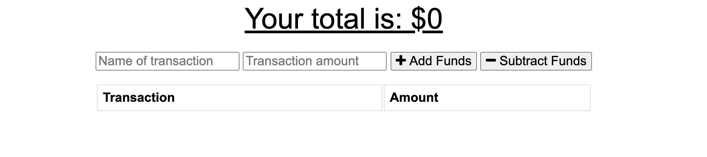

**Budget Tracker**

  ## **Description**
  * The user will be able to add expenses and deposits to their budget with or without a connection. If the user enters transactions offline, the total should be updated when they're brought back online
   
  ## **Table of Contents**
  ### [Installation](#Installation)
  ### [Usage](#Usage) 
  ### [Contributing](#contributing)
    
  ## Installation
  * npm init --y
  * npm i
  * npm install compression
  * npm install express
  * npm i mongoose
  * npm i morgan
  
  
  ## Usage
 

  ## **License:**
  This project is protected under the MIT license.

  ## Contributing
  * express
  * mongoose
  
  ## **Questions**
  * Visit me at [gitHub](http://www.github.com/ryannekillian)
  * For additional questions, please reach me at: ryanne.killian@gmail.com
